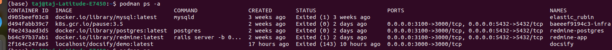
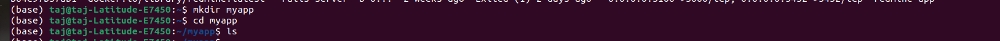
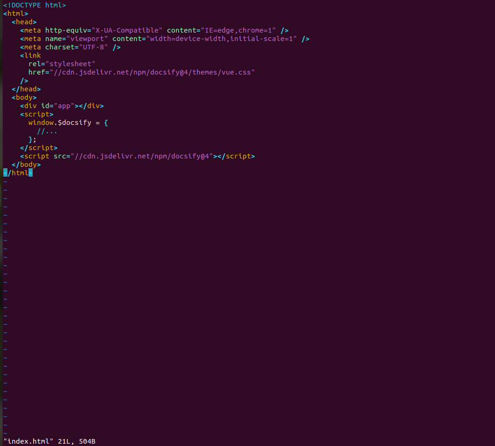
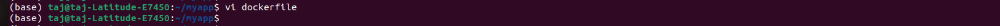
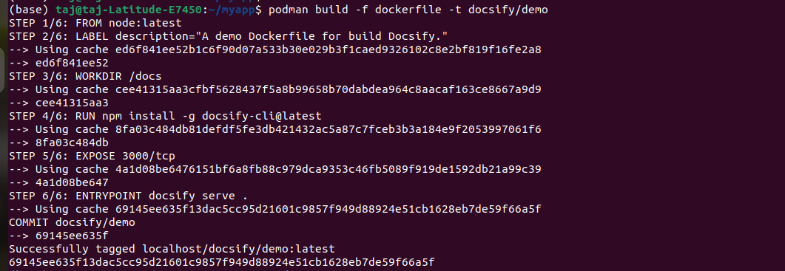
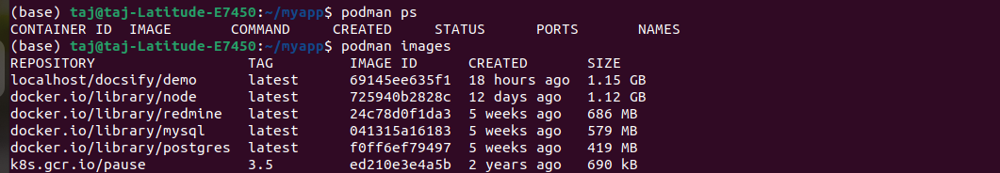
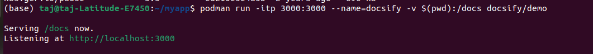
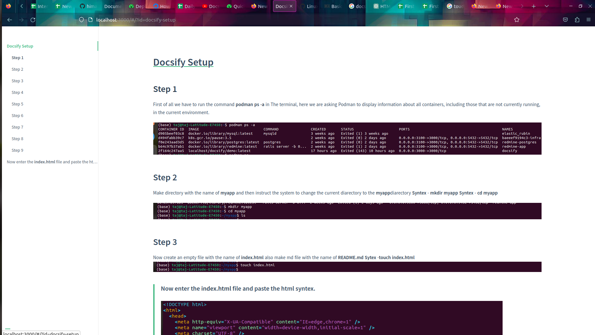

#  Docsify Setup

## **Step 1**
First of all we have to  run the command **podman ps -a**  in The terminal, here we are asking Podman to display information about all containers, including those that are not currently running, in the current environment.

## Step 2
Make directory with the name of **myapp** and then instruct the system to change the current diarectory to the **myapp**diarectory 
**Syntex** - **mkdir myapp**
**Syntex** - **cd myapp**

## Step 3
Now create an empty file with the name of **index.html** also make md file with the name of **README.md**
**Sytex** -**touch index.html**

> #### Now enter the **index.html** file and paste the html syntex.

## Step 4

>Now enter in README.md file with vim command so syntex can update automatically.

Sytex : **vim README.md**

## Step 5

Instruct vim editor to open file named **Docker file** for editing.

> Here **vi** is the Vim text editor and here i am instructing it to open a file name **Dockerfile** for editing. 
**Dockerfile is the name of the file that I want to open.

## Step 6

>Now instruct the Podman to built docker image using the dockefile named Dockerfile and tag the resulting image as **docsify/demo**.
Syntex : **podman build -f dockerfile -t docsify/demo** 

**-f(--file)** -This option is used to specify the path to the Docker file that should be used for building the image.
**-t(--Tag)** - This option used to specify a name and optional tag for the image being build. 

This output provides a detailed view of the steps taken to build the docker image and indicates the use of cached layers to optimizing the build process. The resulting image is tagged as **localhost/docsify/demo:latest**

## Step 7
>Now list the container images that are currently available in your system using the container management tool.

Syntex: **podman ps**

## Step 8 
>Launch the container 

Syntex : **podman run -itp 3000:3000 --name=docsify -v $(pwd):/docs docsify/demo**

The command started a container, named it "docsify", mapped port 3000 from the host to the container, mounted the current working directory from the host into the container's "/docs" directory, and launched a Docsify server that is accessible at "http://localhost:3000". The provided output confirms that the container is successfully serving content and listening on the specified port.

## Step 9

>After that we paste the ULT on browser and check if its working or not.

