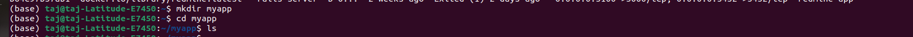

 <h1 align="center"> Docsify Setup</h1>

 ### Docsify- 
 * Docsify is a documentation site generator that focuses on simplicity and ease of use.

 * With Docsify, we can quickly turn our documentation content into a user-friendly website with navigation, search functionality, and other useful features.

 ### Steps of Docsify Setup

1. Create Directory 

>  **mkdir myapp**

> mkdir: **mkdir is a command-line utility that stands for "make directory." It is used to create a new directory (also known as a folder) within a file system.**

> myapp - **Is the name of directory that I have created**

2. Instruct vim editor to open file named **Docker file** for editing.

> Here **vi** is the Vim text editor and here i am instructing it to open a file name **Dockerfile** for editing. 
**Dockerfile is the name of the file that I want to open.

3. Now create an empty file with the name of **index.html** also make md file with the name of **README.md**
 > **touch index.html**

4. Now enter the index.html file using the command.
>vim index.html

5. Paste the HTML syntax.

6. Now into  enter the README.md file. So that the Document text can be updated automatically.

> **vim README.md**

7. **Build Docker Image**

 >**docsify/demo**.
 **podman build -f dockerfile -t docsify/demo**

* **-f(--file)** -This option is used to specify the path to the Docker file that should be used for building the image.
* **-t(--Tag)** - This option used to specify a name and optional tag for the image being build. 

>This output provides a detailed view of the steps taken to build the docker image and indicates the use of cached layers to optimizing the build process. The resulting image is tagged as **localhost/docsify/demo:latest**

8. **Run docker image** 

>**podman run -itp 3000:3000 --name=docsify -v $(pwd):/docs docsify/demo**

* The command started a container, named it "docsify", mapped port 3000 from the host to the container, mounted the current working directory from the host into the container's "/docs" directory, and launched a Docsify server that is accessible at "http://localhost:3000". 
* The provided output confirms that the container is successfully serving content and listening on the specified port.

4 Run local host on browser.

## GitHub
### ***Introduction***
GitHub is a code hosting platform for version control and collaboration. It provides a collaborative environment for developers to work together on projects, track changes, and manage code repositories.

### ***Creating a new repository***

1. In the upper-right corner of any page, use the drop-down menu, and select New repository.

2. In the "Repository name" box,write your repository name.

3. Make a selection for your repository's visibility: Public or Private.

4. Select Add a README.md  file.

5. Click Create repository.

### ***Docsify and Git intigration*** 

1. For creating a new repository on CLI follow all these steps 
* git init
* git add README.md 
* git commit -m "first commit" 

>git init - It is a command in the Git version control system that initializes a new repository in a directory.

>git commit -m "first commit"  - The command git commit -m "first commit" is used to create a new commit in a Git repository with a specific commit message.

* The -m flag is used to specify a commit message. The commit message is a brief description of the changes we're committing.

2. When we change  and update something in our document , run following commands:**
>git branch -M main
> git remote add origin http://github.com.taj4990/docsify_taj.git
> git push -u origin main

3. Enter the user name and then enter.
4. Now for password goto Git settings and create token and make some changes.

5. Token Creation

* Click on settings.

* Click on developer setting

* In Personal access token.
  Select token(classic).

* Click on Generate new token(classic).

* Varify login

* Give name of your token and marks all the boxes and click on create.

* **After submition copy the token and paste it on your CLI(Command line interface).**

* Output image is given below for the better understanding.

>>**git branch -M main**

* **git: This is the command-line interface for the Git version control system.**

* **branch: This is a subcommand in Git used to manage branches within a repository.**

* **-M: This is a command-line option that stands for "move" or "move/rename."** 

* **main: This is the new name I am  assigning to the current branch.**

>>git push -u origin main

* **push: This is a Git command used to send my local changes to a remote repository.**

* **-u: This is a command-line option that stands for "set upstream." When used with the git push command, it establishes a tracking relationship between my local branch and the remote branch I am  pushing to.**